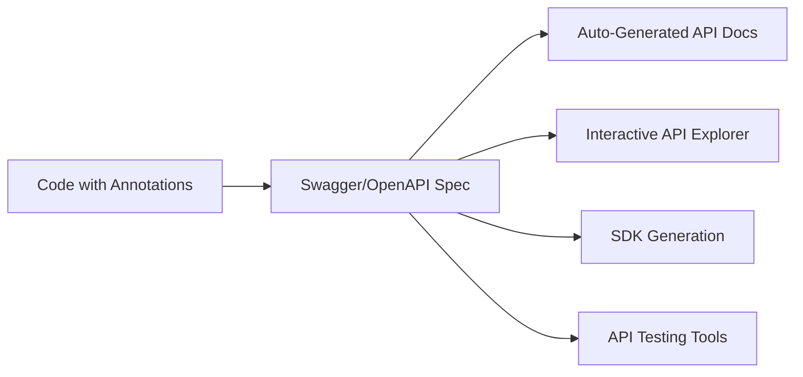

# Issue Type Documentation Matrix - Release Notes vs Documentation Generation

## 🎯 Release Notes Issue Types (Perfect for Automation)

Your structure is **ideal** for automated release notes generation:

### **Release Notes Issue Types:**
- **Open Defects** → "Known Issues" section
- **Defects Closed with Code Changes** → "Bug Fixes" section  
- **Defects Closed without Code Changes** → "Resolved Issues" section
- **Known Issues** → "Limitations" section

### **Auto-Generation Logic:**
```yaml
Release Notes Template:
  Bug Fixes:
    Source: Issues where Issue Type = "Defects Closed with Code Changes"
    Fields: [Symptom, Solution, Affected Versions]
    
  Known Issues:
    Source: Issues where Issue Type = "Open Defects" OR "Known Issues"
    Fields: [Symptom, Workaround, Expected Resolution]
    
  Resolved Issues:
    Source: Issues where Issue Type = "Defects Closed without Code Changes"
    Fields: [Symptom, Resolution Reason]
```

**Why This Works:** Clear, deterministic mapping from Issue Type → Release Notes Section

---

## 📚 Documentation Generation Issue Types (More Complex)

For broader documentation, Issue Types become **less straightforward** but still valuable:

### **Documentation-Focused Issue Types:**

#### **Software Documentation:**
- **Feature Epic** → User Guides, Getting Started, Feature Overview
- **User Workflow Epic** → How-To Guides, Training Materials
- **Installation Epic** → Setup Guides, Admin Documentation
- **API Specification Epic** → API Documentation (when Swagger isn't available)
- **Integration Epic** → Integration Guides, Developer Documentation

#### **Hardware Documentation** (External to JIRA):
You're right - hardware installation guides typically live outside JIRA because:
- Physical procedures don't fit JIRA's issue-tracking model
- Visual/spatial requirements need CAD, photos, videos
- Safety compliance documentation has different governance
- Manufacturing processes have separate toolchains

### **Hybrid Approach for Software:**
```yaml
Documentation Generation Matrix:
  Issue Type: "Feature Epic"
  → Can Generate: [User Guide, Feature Overview, Release Notes]
  → Cannot Generate: [API Docs*, Installation Guide]
  → Missing Elements: [User Workflows, Technical Specifications]
  
  Issue Type: "User Workflow Epic"  
  → Can Generate: [How-To Guides, Training Materials, User Guide]
  → Cannot Generate: [API Docs*, Technical Specifications]
  → Missing Elements: [Technical Implementation Details]
```

*API Docs should come from Swagger/OpenAPI, not JIRA

---

## 🔧 **API Documentation Strategy - Industry Standard Approach**

You're **absolutely correct** about API documentation automation:

### **Current Industry Best Practice:**


### **InfoDev Role Shift:**
- **Traditional:** Write API docs manually from specifications
- **Modern:** Curate and enhance auto-generated docs with:
  - Usage examples and tutorials
  - Integration guides and best practices
  - Error handling and troubleshooting
  - Getting started workflows

### **JIRA's Role for APIs:**
```yaml
JIRA Epic: "Payment API v2.0"
Purpose: Track API development, not document API details
Content:
  - Business requirements and use cases
  - Integration points and dependencies  
  - Testing strategies and acceptance criteria
  - Release planning and versioning

Swagger/OpenAPI: 
Purpose: Auto-generate API documentation
Content:
  - Endpoint specifications
  - Request/response schemas
  - Authentication details
  - Error codes and responses
```

---

## 💡 **Updated Tool Strategy**

### **Focus Areas by Document Type:**

#### **High JIRA Value (Full Automation Possible):**
1. **Release Notes** - Your Issue Type strategy enables 95% automation
2. **User Guides** - Epic descriptions + workflows provide solid foundation
3. **Getting Started Guides** - Prerequisites + supported features from Epics
4. **Known Issues Documentation** - Direct from Open Defects Issue Type

#### **Medium JIRA Value (Partial Automation):**
1. **Installation Guides** - JIRA provides requirements, manual steps needed
2. **Admin Guides** - JIRA provides features, configuration details needed
3. **Training Materials** - JIRA provides use cases, exercises need manual creation

#### **Low JIRA Value (External Tools Better):**
1. **API Documentation** - Swagger/OpenAPI is the standard
2. **Hardware Installation** - CAD, photos, safety procedures external to JIRA
3. **Compliance Documentation** - Requires specific regulatory tooling

### **Recommended Tool Architecture:**

```yaml
Phase 1: "Release Notes Mastery"
  - Perfect the Issue Type → Release Notes automation
  - Validate Epic completeness for release readiness
  - Integration with existing release notes tools (ARNR, etc.)

Phase 2: "User Documentation Automation"  
  - Epic → User Guide generation
  - Epic → Getting Started generation
  - Attachment analysis for visual documentation

Phase 3: "Documentation Ecosystem Integration"
  - JIRA Epics + Swagger → Complete documentation suite
  - External tool integration (Confluence, GitBook, etc.)
  - Cross-platform content synchronization
```

### **Key Insight:**
Your Issue Type strategy for release notes is **immediately implementable** and provides **massive value**. The broader documentation generation is valuable but more complex - perfect for a phased approach.

The API documentation insight is crucial: **don't try to solve what Swagger already solves perfectly**. Focus on the areas where JIRA-based documentation adds unique value.
