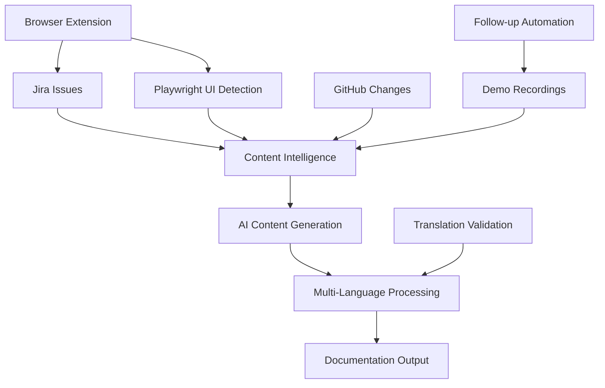

# Comprehensive PRD: Multi-Modal Documentation Intelligence Platform

## Executive Summary

A unified documentation platform that combines Jira workflow intelligence, UI change detection via Playwright automation, GitHub API integration, and multi-modal content generation to create comprehensive, accurate release documentation with minimal manual effort.

## System Architecture Overview

```yaml
Core Components:
  1. Jira Intelligence Layer (Workflow & Content)
  2. UI Change Detection System (Playwright + Browser Extension)
  3. GitHub Integration Service (API/Alert Documentation)
  4. Multi-Modal Content Generation (AI + Human Feedback Loop)
  5. Demo Recording Integration (Loom/Video Analysis)
  6. Translation Consistency Engine
```

## Component Specifications

### **Component 1: Jira Intelligence Service**

_(Previously Detailed - Core Foundation)_

**Status**: Foundation component - must work standalone **Priority**: Implement first for immediate value

```yaml
Standalone Capabilities:
  - Smart content extraction from existing Jira fields
  - AI-powered categorization and documentation generation
  - Release notes automation from Jira data alone
  - Quality scoring and gap identification

Enhanced Capabilities (when integrated):
  - Cross-reference with UI changes from Playwright
  - Validate against GitHub API changes
  - Incorporate demo recording insights
```

### **Component 2: UI Change Detection System**

**Purpose**: Automated detection and documentation of UI changes between releases

#### **Microservice 9: Playwright Automation Service**

```yaml
Technical Specifications:
  Runtime: AWS Lambda (with custom Playwright layer)
  Triggers: 
    - Scheduled runs (nightly/weekly)
    - Release branch deployments
    - Manual trigger via Jira plugin
  Storage: S3 for screenshots, diff images, and analysis results
  AI Integration: GPT-4o Mini for change analysis and description
```

**Core Features:**

```javascript
// Playwright automation workflow
const uiChangeDetection = {
  environments: {
    baseline: 'demo-env-previous-release',
    current: 'demo-env-current-release'
  },
  
  workflows: [
    {
      name: 'navigation-flows',
      steps: ['login', 'dashboard', 'key-features', 'settings'],
      capture: ['screenshots', 'network-requests', 'console-logs']
    },
    {
      name: 'feature-workflows', 
      steps: ['create-item', 'edit-item', 'delete-item'],
      capture: ['screenshots', 'form-interactions', 'api-calls']
    }
  ],
  
  analysis: {
    visualDiff: 'pixel-perfect-comparison',
    functionalDiff: 'interaction-flow-changes', 
    contentDiff: 'text-and-label-changes',
    apiDiff: 'backend-integration-changes'
  }
};
```

#### **Browser Extension Integration**

```yaml
Extension Features:
  - Real-time highlighting of detected changes
  - Overlay documentation suggestions on UI elements
  - Click-to-document workflow for manual additions
  - Integration with Jira issue creation
  - Screenshot annotation tools

Technical Implementation:
  - Chrome Extension (Manifest V3)
  - WebSocket connection to Playwright service
  - Real-time change highlighting overlay
  - Direct integration with demo environments
```

### **Component 3: GitHub Integration Service**

**Purpose**: Track API changes, alerts, and backend features that impact documentation

#### **Microservice 10: GitHub Documentation Sync Service**

```yaml
Technical Specifications:
  Runtime: AWS Lambda (Node.js)
  Triggers: GitHub webhooks, scheduled scans
  Integration: GitHub GraphQL API, REST API
  AI Processing: GPT-4o Mini for change impact analysis
  Storage: S3 for processed change logs and documentation updates
```

**Key Features:**

```javascript
const githubIntegration = {
  monitoring: {
    apiChanges: {
      files: ['*/api/**/*.js', '*/routes/**/*.js', '*/controllers/**/*.js'],
      triggers: ['openapi-spec-changes', 'endpoint-modifications'],
      analysis: 'impact-on-frontend-documentation'
    },
    
    alertSystems: {
      files: ['*/alerts/**/*.js', '*/notifications/**/*.js'],
      triggers: ['new-alert-types', 'message-template-changes'],
      analysis: 'user-facing-alert-documentation'
    },
    
    featureFlags: {
      files: ['*/features/**/*.js', '*/config/features.json'],
      triggers: ['new-features', 'feature-deprecation'],
      analysis: 'documentation-impact-assessment'
    }
  },
  
  documentation: {
    extraction: 'auto-extract-jsdoc-comments',
    translation: 'sync-with-i18n-files',
    validation: 'cross-reference-with-ui-changes'
  }
};
```

### **Component 4: Demo Recording Integration Service**

**Purpose**: Leverage existing demo recordings and request targeted follow-ups

#### **Microservice 11: Video Content Analysis Service**

```yaml
Technical Specifications:
  Runtime: AWS Lambda + MediaConvert
  AI Integration: 
    - Amazon Transcribe (speech-to-text)
    - GPT-4o Mini (content analysis)
    - Amazon Rekognition (visual analysis)
  Storage: S3 for video processing and analysis results
  Integration: Loom API, internal recording systems
```

**Features:**

```yaml
Automated Analysis:
  - Transcribe demo recordings to text
  - Extract key feature demonstrations
  - Identify gaps between recorded demos and detected changes
  - Generate follow-up questions for demo creators

Follow-up Automation:
  - Auto-generate Loom recording requests
  - Template-based follow-up messages
  - Integration with team notification systems
  - Tracking of requested vs. completed follow-ups

Content Enhancement:
  - Extract visual workflows from recordings
  - Generate step-by-step documentation from demos
  - Cross-reference with UI change detection
  - Identify missing documentation areas
```

### **Component 5: Translation Consistency Engine**

**Purpose**: Ensure UI changes, API responses, and documentation stay consistent across languages

#### **Microservice 12: Multi-Language Consistency Service**

```yaml
Technical Specifications:
  Runtime: AWS Lambda (Python)
  Translation: AWS Translate + Custom Glossaries
  Validation: Cross-language consistency checking
  Storage: S3 for translation memories and glossaries
  Integration: GitHub i18n files, Jira content, UI text extraction
```

**Key Features:**

```javascript
const translationConsistency = {
  sources: {
    ui: 'extracted-from-playwright-screenshots',
    api: 'github-i18n-json-files', 
    documentation: 'jira-generated-content',
    alerts: 'github-alert-templates'
  },
  
  validation: {
    terminology: 'consistent-product-names-across-languages',
    context: 'ui-context-matches-documentation-context',
    completeness: 'all-languages-have-equivalent-content'
  },
  
  automation: {
    detection: 'flag-inconsistencies-across-sources',
    correction: 'suggest-updates-for-out-of-sync-content',
    workflow: 'create-jira-issues-for-translation-updates'
  }
};
```

## Integration Architecture

### **Data Flow Between Components**



### **Cross-Component Intelligence**

```yaml
Enhanced Documentation Generation:
  Base: Jira content extraction (standalone capable)
  + UI Changes: Playwright-detected modifications
  + API Changes: GitHub integration insights  
  + Demo Context: Video analysis and follow-ups
  + Translation: Multi-language consistency
  
Result: Comprehensive, accurate, multi-modal documentation
```

## Implementation Roadmap

### **Phase 1: Foundation (Weeks 1-4) - START HERE**

**Priority: Jira Intelligence Service**

```yaml
Why Start Here:
  ✓ Immediate value with existing data
  ✓ Standalone functionality
  ✓ Foundation for all other components
  ✓ Fastest ROI
  ✓ Minimal external dependencies

Deliverables:
  - Jira custom fields (4 fields max)
  - AI content extraction service
  - Browser extension for Jira enhancement
  - Basic release notes automation
  - JQL templates and workflows
```

**Success Criteria:**

- Generate release notes from Jira data alone
- 70% reduction in manual documentation time
- User adoption >60% within 30 days

### **Phase 2: UI Change Detection (Weeks 5-8)**

**Priority: Playwright + Browser Extension**

```yaml
Why Second:
  ✓ Builds on Jira foundation
  ✓ High visual impact for stakeholders
  ✓ Addresses major gap in current process
  ✓ Enables demo environment integration

Deliverables:
  - Playwright automation service
  - UI change detection algorithms
  - Browser extension UI overlay
  - Integration with Jira content generation
  - Demo environment screenshot workflows
```

### **Phase 3: GitHub Integration (Weeks 9-12)**

**Priority: API/Backend Change Tracking**

```yaml
Why Third:
  ✓ Complements UI changes with backend context
  ✓ Ensures technical accuracy
  ✓ Addresses developer-facing documentation
  ✓ API consistency validation

Deliverables:
  - GitHub webhook integration
  - API change detection and analysis
  - Cross-reference with UI changes
  - Enhanced technical documentation
  - Translation file consistency checking
```

### **Phase 4: Multi-Modal Enhancement (Weeks 13-16)**

**Priority: Demo Integration + Translation**

```yaml
Why Last:
  ✓ Builds on all previous components
  ✓ Adds sophisticated content enhancement
  ✓ Addresses remaining edge cases
  ✓ Completes the comprehensive solution

Deliverables:
  - Video analysis service
  - Automated follow-up workflows
  - Translation consistency engine
  - Multi-language documentation
  - Complete end-to-end automation
```

## Testing Strategy by Component

### **Phase 1 Testing (Jira Intelligence)**

```yaml
Test Scenarios:
  - Generate release notes from XCP, NVO, WS projects
  - Validate AI categorization accuracy (target: >85%)
  - Test browser extension with real user workflows
  - Measure documentation quality improvement
  - Load test with historical Jira data
```

### **Phase 2 Testing (UI Detection)**

```yaml
Test Scenarios:
  - Run Playwright against known UI changes
  - Validate change detection accuracy (target: >90%)
  - Test browser extension overlay functionality
  - Cross-reference detected changes with Jira issues
  - Performance test with multiple demo environments
```

### **Phase 3 Testing (GitHub Integration)**

```yaml
Test Scenarios:
  - Monitor API changes in development branches
  - Validate translation file consistency
  - Test webhook reliability and processing speed
  - Cross-validate with UI change detection
  - Accuracy test with known backend changes
```

### **Phase 4 Testing (Multi-Modal)**

```yaml
Test Scenarios:
  - Process existing demo recording library
  - Test automated follow-up generation
  - Validate translation consistency across all sources
  - End-to-end workflow with all components
  - User acceptance testing with complete system
```

## Expected Outcomes by Phase

### **Phase 1 Results:**

- 70% reduction in release notes creation time
- Immediate productivity gains for technical writing team
- Foundation for all subsequent enhancements

### **Phase 2 Results:**

- 90% reduction in UI change documentation gaps
- Visual validation of release content accuracy
- Enhanced demo environment integration

### **Phase 3 Results:**

- Complete technical accuracy for API changes
- Consistent documentation across all languages
- Developer-facing documentation automation

### **Phase 4 Results:**

- Comprehensive, multi-modal documentation
- 95% automation of release documentation process
- Seamless integration across all content sources

**Recommendation: Start with Phase 1 (Jira Intelligence) for immediate value and strong foundation, then proceed sequentially through the phases based on organizational priorities and resource availability.**